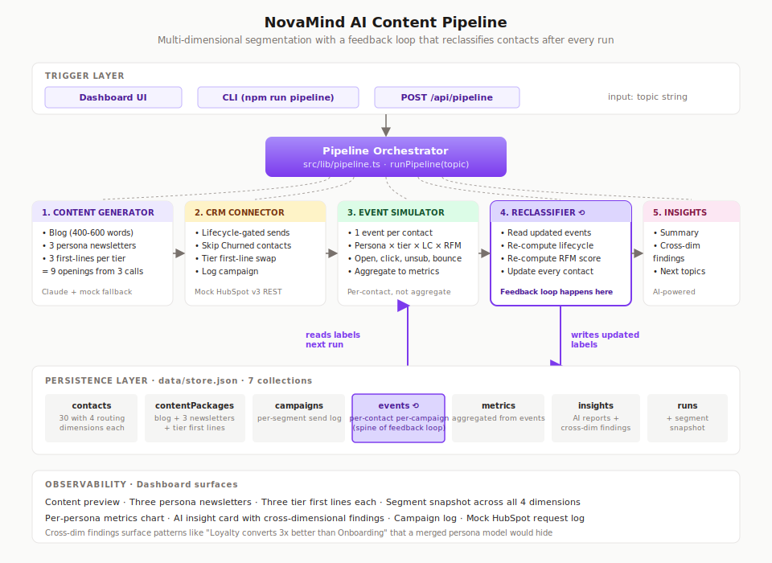

# NovaMind Pipeline

A self-improving, multi-dimensional AI marketing pipeline for **NovaMind**, a fictional early-stage AI startup that helps small creative agencies automate their daily workflows.

Built as a take-home for the Palona AI Content & Growth Analyst Intern role.

## What this pipeline does

One topic string goes in. The pipeline produces:

1. A blog post outline plus a 400 to 600 word draft.
2. Three persona-tailored newsletter variants, each with three seniority-tier first lines (9 variants rendered from 3 generations).
3. Simulated distribution through a mocked HubSpot CRM, routed by lifecycle stage (churned contacts skipped).
4. Per-contact event simulation (delivered, opened, clicked, unsubscribed), not just aggregate metrics.
5. Automatic re-classification of every contact on lifecycle stage and RFM score after each run.
6. An AI-written performance summary with cross-dimensional findings and next-topic suggestions.

The feedback loop runs every time. That is what makes this pipeline self-improving rather than one-shot.

## Live demo

Deployed URL: https://novamind-pipeline.vercel.app

Loom walkthrough: *add your Loom URL here after recording*

## The segmentation model

Each contact carries **four orthogonal routing dimensions** plus one analysis dimension. Keeping them separate is what lets the insight engine find patterns a merged model would hide.

| Dimension | Values | Source | Used for |
|---|---|---|---|
| **Persona** | Agency Founder, Creative Director, Junior Creative | Derived from job title | Content inti and CTA |
| **Seniority Tier** | Emerging, Established, Veteran | Derived from job title + years in role | First line and tone |
| **Lifecycle Stage** | Onboarding, Retention, Loyalty, Churned | Derived from tenure + events | Send gate and stage variant |
| **RFM Score** | Champion, Engaged, At Risk, Dormant | Derived from event history | Urgency and content variant |
| Acquisition Source | Blog, LinkedIn, Referral, Event, Paid Ad | Recorded at subscribe | Cohort analysis only |

### Why orthogonal matters

A Veteran Founder is interested in different content than an Emerging Founder, but both sit in the Agency Founder persona. A Loyalty contact and an Onboarding contact might both be Emerging Juniors, but they need different emails this week.

Merging these dimensions into a single flat persona list would explode into 48 combinations and still hide cross-cut patterns like "Veteran tier clicks less across every persona" or "Loyalty cohort converts 3x better than Onboarding." Those insights only exist when dimensions are tracked separately.

### The feedback loop

After every pipeline run:

1. Per-contact events (delivered, opened, clicked, unsubscribed) are stored with timestamps.
2. Every contact is re-classified on lifecycle stage and RFM score from the full event history.
3. Next run reads those updated labels. Churned contacts skip the send. Champions get priority treatment. Contacts that slipped into At-Risk become candidates for win-back variants.

This is what the brief meant by "continuously improves based on performance metrics."

## Architecture



Five layers, top to bottom:

1. **Trigger layer** — dashboard button, CLI command, or direct POST to `/api/pipeline`.
2. **Pipeline orchestrator** — single function at `src/lib/pipeline.ts`.
3. **Four modules** — content generator, CRM connector, performance simulator (now event-level), insight engine (now multi-dimensional).
4. **Persistence** — JSON file store with seven collections: contacts, contentPackages, campaigns, metrics, events, insights, runs.
5. **Observability** — the dashboard surfaces every artifact: content, segment snapshot, cross-dim findings, campaign log, HubSpot request log.

## Target personas

NovaMind sells to small creative agencies. The readers inside those agencies split into three personas, each with a distinct copy angle and CTA:

| Persona | Who they are | Copy angle | CTA |
|---|---|---|---|
| **Maya, Agency Founder** | Runs a 5 to 30 person shop, watches margin | Business outcomes, proof from comparable agencies | Book a 20-minute demo |
| **Devon, Creative Director** | Leads creative at a video or brand studio | AI as an amplifier, taste-forward | Read the founder interview |
| **Sam, Junior Creative** | 0 to 2 years in, most AI-native of the three | AI as an on-demand mentor, templates, shortcuts | Grab the starter template pack |

Each persona then has three seniority variants that swap only the first line of the newsletter at send time, based on whether the recipient is Emerging, Established, or Veteran in their current role. Nine total openings from three LLM calls per blog.

## Tools, APIs, and models

| Layer | Choice | Why |
|---|---|---|
| Framework | Next.js 14 App Router | Single codebase for UI and API, one-command local dev, clean Vercel deploy. |
| Language | TypeScript | Clear contracts between modules. Production signal. |
| AI | Anthropic Claude Sonnet 4.5 via `@anthropic-ai/sdk` | Structured JSON output for blog, newsletter, first-line-by-tier, and insight generation. Falls back to a hand-written mock generator when no API key is set. |
| CRM | Mock HubSpot v3 REST | Endpoints and payloads match the real HubSpot API. Custom properties include `persona`, `seniority_tier`, `novamind_lifecycle_stage`, `rfm_score`, `acquisition_source`. Every call is logged to the dashboard. |
| Classification | Rule-based with keyword + years-in-role signals | Fast, explainable, swappable for LLM or enrichment API later. |
| Performance data | Per-contact event simulator with persona × tier × lifecycle × RFM multipliers | Realistic enough to produce meaningful cohort insights. Backfill generates plausible historical events for seeded contacts so RFM works from run one. |
| Styling | Tailwind CSS | Fast, consistent. |
| Charts | Recharts | Lightweight, React-native. |
| Storage | File-backed JSON | Zero-setup for reviewers. Same schema ports to SQLite or Postgres with no business-logic changes. |

## Assumptions

- **HubSpot is mocked.** The assignment said this was fine. Endpoint names, HTTP methods, and payload shapes match HubSpot v3 REST API. A real integration swaps `src/lib/crm/hubspot-mock.ts` for thin wrappers around the official SDK without changing any call sites.
- **Email sends are not real.** The pipeline logs a send receipt and moves on. In production the same call site would hand off to HubSpot Marketing Emails or a provider like Customer.io.
- **Performance events are simulated, not fetched.** The simulator generates one event record per contact per campaign with realistic per-persona and per-tier baselines. In production these would be polled from the already-stubbed `hubspot.fetchEmailStatistics()`.
- **Seeded events are backfilled.** 30 mock contacts with realistic tenure (8 to 340 days) need plausible historical engagement so the first run has meaningful lifecycle and RFM states. `backfillHistoricalEvents()` generates weekly sends per contact with a latent engagement level plus a 25% disengagement chance for long-tenure contacts. This gives the demo non-zero counts in every lifecycle stage.
- **Rule-based classifiers.** Persona and seniority come from keyword matching on job titles. Explainable and defensible, and easy to swap for LLM or enrichment API. The classifiers live in `src/lib/classifiers.ts`.
- **Mock AI fallback.** Without an Anthropic API key, content generator and insight engine use hand-written fallbacks that still hit the 400-600 word blog target and produce three distinct persona-specific newsletters with three tier-specific first lines each.

## API surface

All routes are under `/api`. All respond with JSON.

| Method | Endpoint | Purpose |
|---|---|---|
| POST | `/api/pipeline` | Full end-to-end run. Body: `{ topic: string }`. |
| POST | `/api/generate` | Content generation only. Body: `{ topic: string }`. |
| POST | `/api/analyze` | Re-run the insight engine on an existing content package. Body: `{ contentPackageId: string }`. |
| GET | `/api/campaigns` | Campaigns, metrics, runs, insights, content packages, CRM request log. |
| GET | `/api/contacts` | All contacts with their current routing labels. |

## Running locally

Requirements: Node 18 or higher, npm.

```bash
# 1. Clone and install
git clone <this-repo>
cd novamind-pipeline
npm install

# 2. (Optional) Add your Anthropic API key for live AI generation
cp .env.example .env
# then edit .env and paste your key

# 3. Seed 30 mock contacts with realistic job titles and backfilled events
npm run seed

# 4. Run the pipeline from the CLI (optional smoke test)
npm run pipeline "How a 10-person studio reclaims 20 hours a week"

# 5. Launch the dashboard
npm run dev
# then open http://localhost:3000
```

After seed, you should see segment distribution printed:

```
Lifecycle stage distribution (post-backfill):
  onboarding: 6
  retention: 15
  loyalty: 4
  churned: 5

RFM score distribution:
  champion: 9
  engaged: 7
  at_risk: 7
  dormant: 7
```

## Project structure

```
novamind-pipeline/
├── src/
│   ├── app/
│   │   ├── page.tsx                       # Dashboard (client component)
│   │   ├── layout.tsx, globals.css
│   │   └── api/
│   │       ├── pipeline/route.ts          # POST: full run with feedback loop
│   │       ├── generate/route.ts          # POST: content only
│   │       ├── analyze/route.ts           # POST: re-run insights
│   │       ├── campaigns/route.ts         # GET: dashboard data
│   │       └── contacts/route.ts          # GET: contacts with routing labels
│   ├── components/
│   │   ├── PersonaCard.tsx                # + TierBadge, LifecycleBadge, RfmBadge
│   │   ├── ContentPreview.tsx             # Blog + 3 newsletters + tier first lines
│   │   ├── SegmentSnapshot.tsx            # All 4 routing dimensions visualized
│   │   ├── MetricsChart.tsx               # Per-persona campaign performance
│   │   ├── InsightCard.tsx                # AI summary + cross-dim findings
│   │   ├── CampaignLog.tsx                # Send log table
│   │   └── CrmLog.tsx                     # HubSpot API request log
│   └── lib/
│       ├── types.ts                       # 4-dimension Contact, ActivityEvent, etc
│       ├── personas.ts                    # Personas + SENIORITY_PROFILES + labels
│       ├── classifiers.ts                 # All four dimension classifiers
│       ├── pipeline.ts                    # Orchestrator with feedback loop
│       ├── ai/
│       │   ├── client.ts                  # Anthropic SDK wrapper
│       │   ├── prompts.ts                 # Blog, newsletter, first-line, insight
│       │   ├── content-generator.ts       # Claude + mock fallback
│       │   └── insight-engine.ts          # Multi-dim cross-cut analysis
│       ├── crm/
│       │   └── hubspot-mock.ts            # v3 REST-shaped mock
│       ├── analytics/
│       │   └── performance-simulator.ts   # Per-contact event generation + backfill
│       └── db/
│           └── store.ts                   # File-backed JSON store (7 collections)
├── scripts/
│   ├── seed.ts                            # 30 realistic contacts + event backfill
│   └── run-pipeline.ts                    # CLI runner
├── docs/
│   ├── architecture.svg                   # Diagram in README
│   ├── LOOM_SCRIPT.md                     # Demo walkthrough script
│   └── DEPLOY.md                          # Vercel deploy guide
├── data/                                  # Runtime store (gitignored)
└── (config: package.json, tsconfig, tailwind, postcss, next.config)
```

## What I would build next

Listed roughly in order of business impact.

1. **Win-back campaigns for Churned and At-Risk.** Today Churned contacts skip the send. The next step is a parallel pipeline that generates dedicated re-engagement content for them, with different subject lines and softer CTAs.
2. **A/B testing inside the pipeline.** Generate two subject lines per persona, send each to half the segment, record the winner, feed it into future generations.
3. **Auto-scheduled runs.** The insight engine already suggests next topics. A weekly cron could pick the top suggestion, run the pipeline, and queue the drafts for review.
4. **Real HubSpot integration.** Swap the mock for the official SDK. Call sites do not change.
5. **Segment migration visualization.** Show contacts moving between lifecycle stages and RFM buckets over time. The `segmentSnapshot` field on `PipelineRun` already captures the data; just needs a chart.
6. **LLM-based classifier.** Replace the rule-based `classifyPersona` with an LLM call for edge cases (niche titles, non-English titles). The current classifier is the fallback.

## Notes on the prompts

The blog, newsletter, first-line, and insight prompts in `src/lib/ai/prompts.ts` do most of the quality work.

- Blog and newsletter prompts frame Claude as **the Head of Content at NovaMind**, writing for a specific audience, not as a general AI assistant. That single framing lifts output quality more than any other change.
- First-line prompts are strict about differentiating tiers. Each of the three openings must feel clearly distinct — if two feel interchangeable, the prompt says rewrite.
- The insight prompt demands specific numbers in findings. Vague analyst output is the easiest LLM failure mode, and the easiest to prevent with a tighter prompt.
- Every prompt bans em dashes and a handful of AI tells (*"in today's landscape"*, *"imagine a world"*). Deliberate style choice to keep output sounding like a human content lead wrote it.

---

Built by Agung Nugroho · Columbia SPS, MS Technology Management
